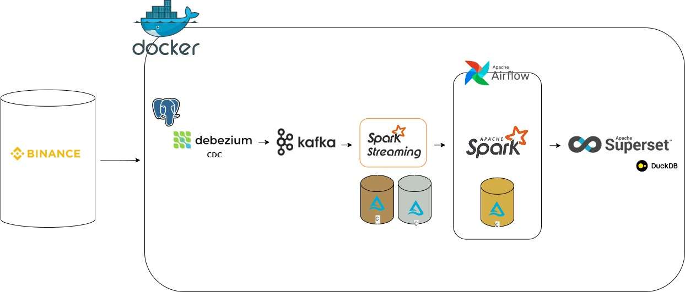

# Real-Time Data Platform

Pipeline de datos en tiempo real con arquitectura Medallion (Bronze / Silver / Gold).
Ingesta trades reales de Binance via CDC, procesa con Spark Structured Streaming y orquesta con Airflow.

---

## Arquitectura



```
Binance REST API (/api/v3/trades)
        │
        ▼ polling cada 10s
   PostgreSQL  ──── WAL ────►  Debezium  ──►  Kafka
                                                │
                                                ▼
                                        Spark Structured Streaming
                                         │              │
                                         ▼              ▼
                                      Bronze          Silver
                                      (raw CDC)    (limpio, tipado)
                                                       │
                                               Airflow (cada 30 min)
                                               │       │       │
                                               ▼       ▼       ▼
                                             OHLCV  Pressure Ranking
                                              └───── Gold ─────┘
                                                      │
                                                      ▼
                                                  Superset
```

**Flujo completo:**
1. `data_generator.py` hace polling de la API REST de Binance e inserta trades en PostgreSQL.
2. Debezium captura los cambios via WAL (CDC) y los publica en Kafka.
3. Spark Streaming lee el topic Kafka y escribe en Bronze (raw) y Silver (limpio) como streams continuos.
4. Airflow ejecuta jobs batch de Spark cada 30 minutos para calcular las tres tablas Gold.

---

## Stack tecnológico

| Capa | Tecnología |
|---|---|
| Fuente de datos | Binance REST API pública |
| Base de datos operacional | PostgreSQL 15 (WAL logical replication) |
| CDC | Debezium 2.4 (connector PostgreSQL) |
| Mensajería | Apache Kafka 7.5 (Confluent) |
| Procesamiento | Apache Spark 3.5.1 (Structured Streaming) |
| Almacenamiento | Delta Lake 3.1.0 (arquitectura Medallion) |
| Orquestación | Apache Airflow 2.x |
| Visualización | Apache Superset |

---

## Servicios y puertos

| Servicio      | URL                        | Credenciales            |
|---------------|----------------------------|-------------------------|
| Kafka UI      | http://localhost:8080      | —                       |
| Airflow       | http://localhost:8081      | admin / admin123        |
| Debezium API  | http://localhost:8083      | —                       |
| Superset      | http://localhost:8088      | admin / admin123        |
| Debezium UI   | http://localhost:8090      | —                       |
| pgAdmin       | http://localhost:5050      | admin@admin.com / admin |
| PostgreSQL    | localhost:5432             | postgres / postgres     |

---

## Perfiles Docker

El proyecto usa perfiles para levantar solo los servicios necesarios.

| Perfil          | Servicios incluidos |
|-----------------|---------------------|
| `core`          | postgres, generator, zookeeper, kafka, debezium, connector-init, spark |
| `monitoring`    | kafka-ui, debezium-ui, pgadmin |
| `orchestration` | airflow (postgres, init, webserver, scheduler) |
| `viz`           | superset |

---

## Inicio rápido

```bash
# 1. Clonar y situarse en el directorio del proyecto
git clone <repo-url>
cd "Real-Time Data Platform"

# 2. Levantar el pipeline core
docker compose -f docker/docker-compose.yml --profile core up -d --build

# 3. Verificar que el conector Debezium se registró correctamente
curl -s http://localhost:8083/connectors/postgres-connector/status | python3 -m json.tool

# 4. Comprobar mensajes en Kafka
docker exec realtimeplatform-kafka kafka-console-consumer \
  --bootstrap-server localhost:9092 \
  --topic dbserver1.public.trades \
  --from-beginning --max-messages 5

# 5. Ver logs del job de Spark Streaming
docker logs realtimeplatform-spark --tail 30
```

---

## Añadir perfiles sobre el core en marcha

Una vez el core está corriendo se pueden activar perfiles adicionales sin parar nada:

```bash
# Monitorización (Kafka UI · Debezium UI · pgAdmin)
docker compose -f docker/docker-compose.yml --profile monitoring up -d

# Orquestación — Airflow
docker compose -f docker/docker-compose.yml --profile orchestration up -d
# → Entrar en http://localhost:8081 y activar el DAG "crypto_pipeline"

# Visualización — Superset
docker compose -f docker/docker-compose.yml --profile viz up -d
# → Entrar en http://localhost:8088 (admin / admin123)

# Todo a la vez desde cero
docker compose -f docker/docker-compose.yml \
  --profile core --profile monitoring --profile orchestration --profile viz \
  up -d --build
```

Para parar un perfil concreto sin afectar al resto:

```bash
# Parar solo Airflow
docker compose -f docker/docker-compose.yml --profile orchestration down

# Parar solo monitorización
docker compose -f docker/docker-compose.yml --profile monitoring down

# Reset completo — para todo y borra volúmenes
docker compose -f docker/docker-compose.yml \
  --profile core --profile monitoring --profile orchestration --profile viz \
  down -v
```

---

## Capas Delta Lake

| Capa   | Path                                    | Frecuencia    | Descripción |
|--------|-----------------------------------------|---------------|-------------|
| Bronze | `lakehouse/bronze/trades`               | Stream (60s)  | Eventos CDC crudos del envelope Debezium |
| Silver | `lakehouse/silver/trades`               | Stream (60s)  | Trades limpios, tipados y deduplicados |
| Gold   | `lakehouse/gold/ohlcv`                  | Batch (30min) | Velas OHLCV por minuto (histórico completo) |
|        | `lakehouse/gold/buy_sell_pressure`      | Batch (30min) | Presión compradora/vendedora por minuto (24h) |
|        | `lakehouse/gold/volume_ranking`         | Batch (30min) | Ranking de símbolos por volumen USDT (24h) |

---

## DAG de Airflow

**`crypto_pipeline`** — schedule: cada 30 minutos

```
check_bronze_silver_streams
        │
        ▼
   gold_ohlcv → gold_buy_sell_pressure → gold_volume_ranking
                                                 │
                                                 ▼
                                           report_stats
```

Los jobs Gold se lanzan via `docker exec` + `spark-submit` sobre el contenedor Spark, sin necesidad de Java en el contenedor de Airflow.

---

## Estructura del proyecto

```
.
├── config/           # Settings y variables de entorno
├── dags/             # DAG de Airflow
├── docker/           # Dockerfiles, docker-compose y configuración Debezium
├── ingestion/        # Módulo de ingesta
├── lakehouse/        # Capas Bronze, Silver y Gold (lógica de transformación)
├── schemas/          # Schemas de entrada (Debezium, trades) y salida (por capa)
├── scripts/          # data_generator, run_gold, query_layers, init SQL
├── streaming/        # SparkSession y procesador CDC
├── tests/            # Tests unitarios por capa
└── main.py           # Entrypoint: arranca Bronze + Silver streaming
```

---

## Superset — conexión DuckDB y queries

Superset lee las tablas Delta Lake directamente mediante **DuckDB + extensión Delta**, sin necesidad de un servidor adicional. El volumen `lakehouse_data` está montado en `/lakehouse` dentro del contenedor.

### 1. Añadir la conexión en Superset

`Settings → Database Connections → + Database → Other`

| Campo | Valor |
|---|---|
| Display name | DuckDB Delta |
| SQLAlchemy URI | `duckdb:///:memory:` |

En **Advanced → Security** activar:
- ✅ **Allow DML** — necesario para poder ejecutar `CREATE VIEW`, `CREATE TABLE AS` y otras sentencias en SQL Lab

Guardar y probar la conexión.

### 2. Queries de ejemplo

**Silver — últimos trades en tiempo real**
```sql
SELECT
    trade_time,
    symbol,
    price,
    quantity,
    quote_qty,
    side
FROM delta_scan('/lakehouse/silver/trades')
ORDER BY trade_time DESC
LIMIT 100;
```

**Gold — velas OHLCV de BTCUSDT**
```sql
SELECT
    candle_time,
    open,
    high,
    low,
    close,
    volume_usdt,
    num_trades
FROM delta_scan('/lakehouse/gold/ohlcv')
WHERE symbol = 'BTCUSDT'
ORDER BY candle_time DESC
LIMIT 60;
```

**Gold — presión compradora vs vendedora por símbolo**
```sql
SELECT
    symbol,
    side,
    SUM(volume_usdt)  AS total_volume_usdt,
    SUM(num_trades)   AS total_trades,
    AVG(avg_price)    AS avg_price
FROM delta_scan('/lakehouse/gold/buy_sell_pressure')
GROUP BY symbol, side
ORDER BY symbol, side;
```

**Gold — ranking de volumen (últimas 24h)**
```sql
SELECT
    symbol,
    total_volume_usdt,
    total_trades,
    price_low,
    price_high,
    last_price,
    ROUND(price_range_pct, 2) AS volatilidad_pct
FROM delta_scan('/lakehouse/gold/volume_ranking')
ORDER BY total_volume_usdt DESC;
```

**Comparativa buy vs sell en tiempo (útil para gráfico de área)**
```sql
SELECT
    window_time,
    symbol,
    MAX(CASE WHEN side = 'buy'  THEN volume_usdt END) AS buy_volume,
    MAX(CASE WHEN side = 'sell' THEN volume_usdt END) AS sell_volume
FROM delta_scan('/lakehouse/gold/buy_sell_pressure')
WHERE symbol = 'BTCUSDT'
GROUP BY window_time, symbol
ORDER BY window_time DESC
LIMIT 60;
```

---

## Tests

```bash
pip install pyspark==3.5.1 delta-spark==3.1.0 pytest

pytest tests/ -v
```

---

## Reset completo

```bash
docker compose -f docker/docker-compose.yml \
  --profile core --profile monitoring --profile orchestration --profile viz \
  down -v
```
